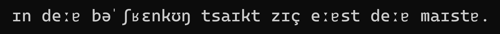
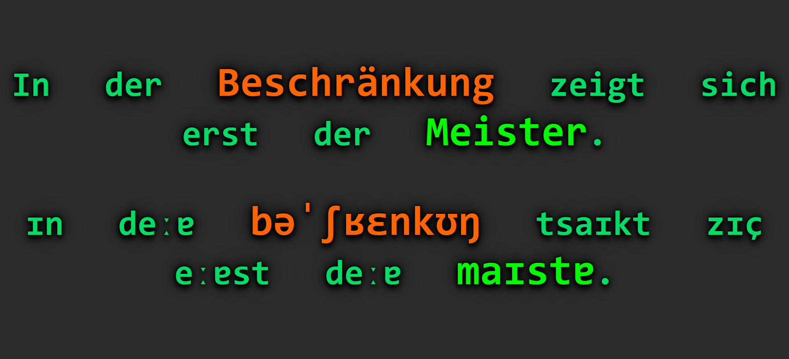

# german2ipa
This command line script converts German next into the International Phonetic Alphabet (IPA) by improving eSpeak's phonetic outputs.
The outputs should more closely resemble those seen on Wiktionary.

## Setup
```pip install phonemizer regex espeakng```

## Usage

```py german2ipa "In der Beschränkung zeigt sich erst der Meister."```

Prints:


If you want it to have nouns styled with CSS depending on their grammatical gender, add `--html` to your command.

```py german2ipa --html "In der Beschränkung zeigt sich erst der Meister."```

<details>
  
<summary>This will print out two lines:</summary>

```In der <span class="die-noun">Beschränkung</span> zeigt sich erst der <span class="der-noun">Meister</span>.```

```ɪn deːɐ <span class="die-noun">bəˈʃʁɛnkʊŋ</span> tsaɪkt zɪç eːɐst deːɐ <span class="der-noun">maɪstɐ</span>.```
</details>

<details>
  
<summary>Which when stylized with this CSS file...</summary>
  
```
.der-noun, .plural-der-noun {
  color: rgb(0, 250, 0);
  font-size: 1.2em;
}

.die-noun, .plural-die-noun {
	color: red;
  font-size: 1.2em;
}

.das-noun, .plural-das-noun {
	color: rgb(0, 75, 250);
  font-size: 1.2em;
}

.verb-no-plural-noun {
	color: rgb(150, 155, 250);
  font-size: 1.5em;
}

.plural-der-noun, .plural-die-noun, .plural-das-noun {
	font-style: italic;
}
```
</details>

Gives us this:



<br>

You can also have it transcribe a file of German text line-by-line.
```py german2ipa mytext.txt```
